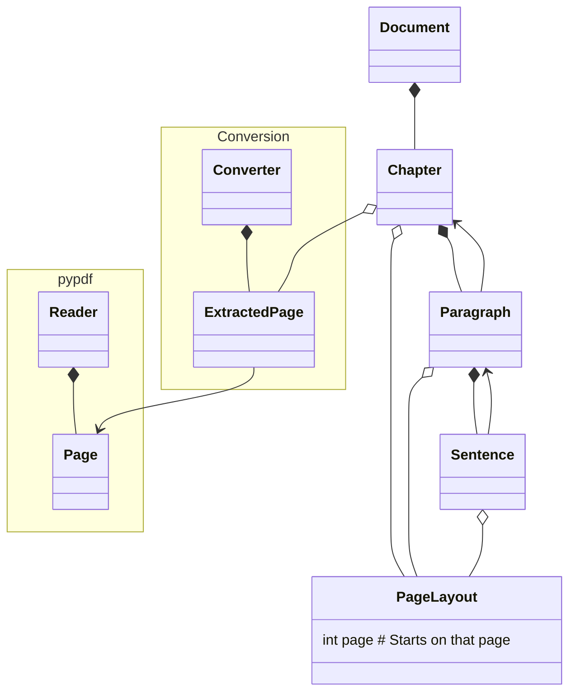

# Extracting the book semantic structure out of Collecting Gold Dust book<!-- omit from toc -->

## Table of contents<!-- omit from toc -->

- [Introduction](#introduction)
- [Running things](#running-things)
- [Model class diagram](#model-class-diagram)
- [References How to recover document structure and plain text from PDF?](#references-how-to-recover-document-structure-and-plain-text-from-pdf)

## Introduction

This directory holds a [copy of the pdf version of Sayadaw U Tejaniya's book
COLLECTING GOLD DUST Nurturing the Dhamma in Daily Living](./original_data/2019_-_Sayadaw-U-Tejaniya-Collecting-Gold-Dust-Web-Book-1.pdf) as offered e.g. by [this Scribd link](https://www.scribd.com/document/716383730/Collecting-Gold-Dust-Web-Book-1) 

## Running things

```bash
python3.10 -m venv venv
source ./venv/bin/activate
pip install -r requirements.txt
python main.py
```

## Model class diagram



## References How to recover document structure and plain text from PDF?

- Reddit post on [How to recover document structure and plain text from PDF?](https://www.reddit.com/r/LocalLLaMA/comments/1am3fz8/how_to_recover_document_structure_and_plain_text) with a focus on RAG applications.
- PDFMiner.six [explanations of how difficult extracting text from pdf can be](https://pdfminersix.readthedocs.io/en/latest/topic/converting_pdf_to_text.html)
